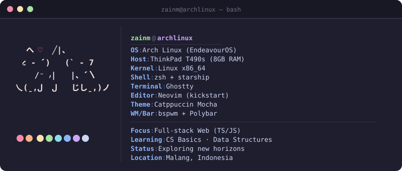
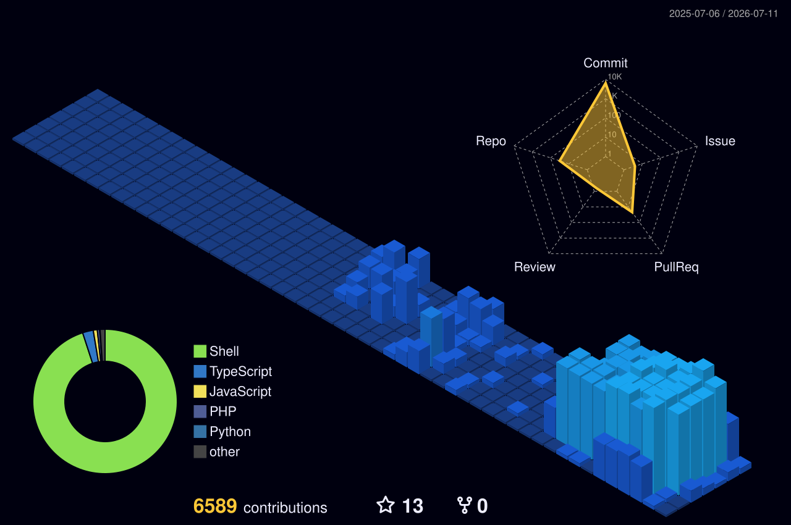

  

 

&nbsp;

&nbsp;

&nbsp;

  

 

---

  <h3>🛠️ Tech Stack & Tools</h3>
  
  

    
    
    
    
    
  

  
  

    
    
    
    
    
    
  

  

    
    
    
    
    
    
  

---

### `$ gh stats`

  

 

  

---

  <code>// Talk is cheap. Show me the code. — Linus Torvalds</code>

